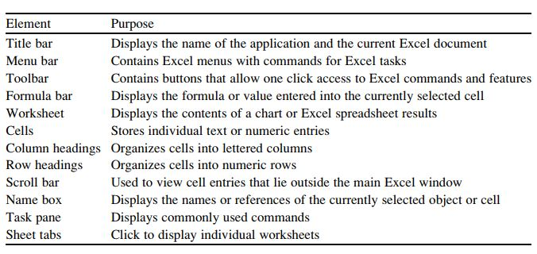
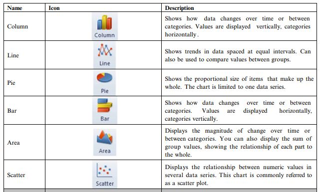
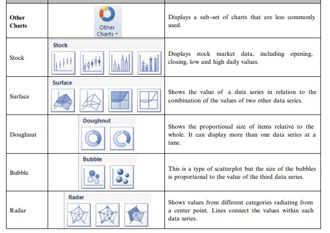
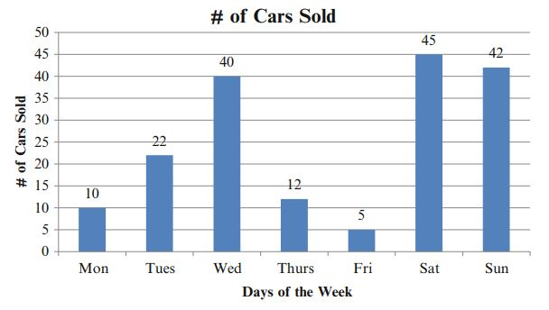
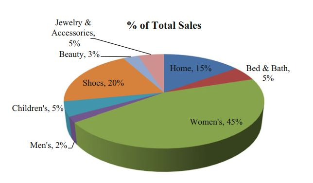
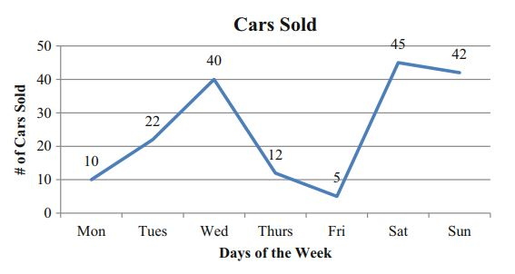
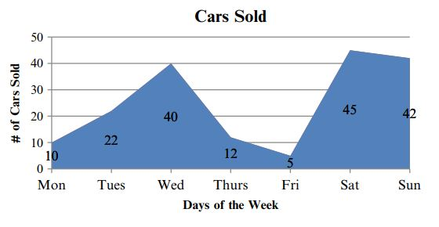

## Basic Concepts

- Start up Excel
- Adding the **Data Analysis Toolpak**
- Excel Elements




## Entering Formulas

- Click inside the formula bar
- Type in an "=" sign and type in your formula or click on the $fx$ symbol to choose from the drop down menu.
- Symbols used in Excel functions

```{r, echo=FALSE, message=FALSE}
library(tidyverse)
tibble(Operator = c('\\+', '\\-', "/", "\\*", "\\^"),
       Description = c("Addition",
                       "Subtraction", 
                       "Division",
                       "Multiplication",
                       "Exponentiation")) %>%   kableExtra::kable() %>% 
  kableExtra::kable_styling()
```


## Cell References

- For a list of data values use a colon `:`. E.g. `SUM(A2:A11)`.
- For a fixed reference use dollar `$` signs. E.g. `SUM($A$2:$A$11)`.

## Sorting data
- Click on **Data** tab
- Choose the **Sort** function
- Select the type of sorting
  - Multilevel sorting 

## Filtering data
- Highlight the data or column that you want to filter.
- Click on the **Data** tab.
- Click on **Filter** function
- Click on the drop down arrow on the first cell

## Statistical tools
- Click on **Data** tab
- Click on **Data Analysis** function

## Predefined or Built-in Fromulas
- Click on **Formulas** tab
- Click on **fx** of **Insert Function** button
- Click on **Statistical** from the drop down menu to indicate the category.

## Formatting Data
- Right click on the cells you wish to format
- Select the **Format Cells** option
- Select **Number** under **Category**
- Choose the correct number of decimal places.

## Chart Wizard




---



## Formatting of Graphs
- Click on the graph
- Click on the **Layout** tab
- Click on **Chart Title** or **Data Labels** or other aspects of the graph.

## Bar and Column Charts
- Example: You own a small used car lot and want to do some analysis with car sales and the days of the week that the cars were sold.
- Enter the data
```{r, echo=FALSE, warning=FALSE, message=FALSE}
library(kableExtra)
tibble(`Days of the week` = c("Mon", "Tues", "Wed", "Thu", "Fri", "Sat", "Sun"),
       `No of cars sold` = c(10, 22, 40, 12, 5, 45, 42)) %>% 
  kable() %>% 
  kable_styling(position = "center", full_width = FALSE)
```

---

- Highlight the two columns of data
- Select the **Insert** tab.
- Select the **Column** chart function
- Click anywhere on the chart
- Click the **Layout** tab, under **Chart Tools**
- Click the **Data Labels** to add the data labels
- Click the **Axis Titles** function to add appropriate vertical and horizontal labels

---



## Pie Charts
- Example: As the store manager you wish to complete some sales analysis on each of the departments in your store. The sales data is “% of total sales” by “department.”
- Enter the text and numbers in columns A and B
```{r, echo=FALSE, warning=FALSE, message=FALSE}
library(kableExtra)
tibble(`Department` = c("Home", "Bed & Bath", "Women's", "Men's", "Children's", "Shoes", "Beauty", "Jewelery & Accessories"),
       `% of Total Sales` = c(15, 5, 45, 2, 5, 20, 3, 5)) %>% 
  kable() %>% 
  kable_styling(position = "center", full_width = FALSE)
```

---

- Highlight the 2 columns of data
- Select the **Insert** tab
- Select the **Pie** chart function
- Choose type of pie chart you want
- Click anywhere on the chart
- Click the **Layout** tab, under Chart Tools
- Click the **Data Labels** function, to add data labels
- If you want percentages on the chart, you need to format the data cells as percentage.

---




## Line Charts and Area Charts
- Example: You own a small used car lot and want to do some analysis with car sales and the days of the week that the cars were sold.
- Enter the data
```{r, echo=FALSE, warning=FALSE, message=FALSE}
library(kableExtra)
tibble(`Days of the week` = c("Mon", "Tues", "Wed", "Thu", "Fri", "Sat", "Sun"),
       `No of cars sold` = c(10, 22, 40, 12, 5, 45, 42)) %>% 
  kable() %>% 
  kable_styling(position = "center", full_width = FALSE)
```

---

- Highlight the 2 columns of data
- Select the **Insert** tab
- Select the **Line** or **Area** function as desired



---




## Bubble Chart
